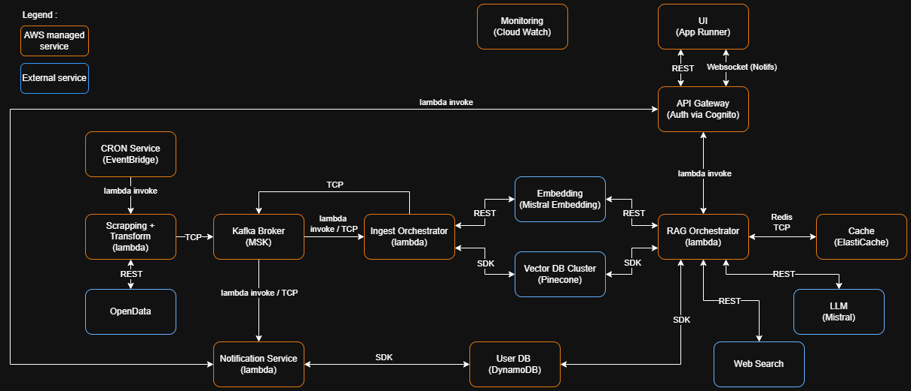

# Conversational AI System — RAG Pipeline & Production Architecture Design

`Python` `LangChain` `FAISS` `Mistral AI` `FastAPI` `Docker`

---

## Overview

Two-part project: a functional RAG pipeline (POC) and a full production architecture design derived from its findings.

The POC implements end-to-end semantic search and conversational AI over French public events data. The architecture study documents the trade-off analysis and technical decisions required to transition the POC to a scalable, production-ready MVP — covering cloud infrastructure, cost modeling, observability, and component modularity.

---

## Part 1 — RAG Pipeline (POC)

### Architecture decisions

**Two-stage LLM pipeline — deliberate separation of concerns.**  
The pipeline uses two distinct LLM calls by design. The first call focuses exclusively on extracting structured metadata filters from the user's natural language query (location, date, category). The second generates the final answer from the retrieved context. Conflating both into a single call would produce inconsistent results — query understanding and answer generation are fundamentally different tasks that benefit from dedicated prompts and independent testability.

**FAISS FlatL2 + IndexIDMap — exact search, deliberate scope.**  
FAISS was chosen to keep the stack fully local and dependency-free — no external service, no API cost during development, no network latency. The FlatL2 index guarantees exact nearest-neighbor search (no approximation), which is appropriate at POC scale and makes results fully deterministic. The IndexIDMap wrapper maintains explicit vector-to-event-ID mapping, keeping metadata retrieval clean. The tradeoff is explicit: FlatL2 does not scale beyond a few hundred thousand vectors without linear memory and latency growth. Approximate indexes (IVF, HNSW) and a managed vector DB are identified as the next steps for production (see Part 2).

**Metadata stored separately as a pickle file.**  
FAISS stores vectors only. Event metadata (title, date, location, URL, category) is stored alongside in a pickle file and loaded at chatbot startup. This avoids re-embedding on each restart and keeps the ingestion and querying services fully decoupled. A production setup replaces pickle with a proper metadata store.

**Single embedding model ecosystem (Mistral).**  
Both the ingestion pipeline (event embedding) and the chatbot service (query embedding) use the same `mistral-embed` model. Using the same model for both guarantees semantic consistency — the query vector and the indexed event vectors live in the same embedding space. Mixing models would introduce alignment drift and degrade retrieval quality.

**Ingestion and chatbot as separate containerized services.**  
Ingestion runs once (or on schedule) and writes FAISS + pickle artifacts to a shared volume. The chatbot service loads these artifacts at startup and serves queries independently. This decoupling means: embeddings are not recomputed on chatbot restarts (cost control), ingestion can be re-run without touching the API service, and each service scales independently.

**LLM role deliberately constrained.**  
The LLM (mistral-small) is used only to extract filters and synthesize the final response from the top-3 retrieved events. It does not perform retrieval itself. This reduces hallucination risk — the LLM works from a bounded, structured context rather than generating from open-ended prompts.

---

### Pipeline

<table>
  <tr>
    <td align="center">
      <b>Vector Builder Diagram</b><br>
      
    </td>
    <td align="center">
      <b>Chatbot Orchestrator Diagram</b><br>
      
    </td>
  </tr>
</table>

---

### Tech stack

| Layer | Tools |
|---|---|
| Data source | OpenDataSoft (REST API) |
| Embeddings & LLM | Mistral AI (mistral-embed · mistral-small) |
| Vector index | FAISS (FlatL2 + IndexIDMap) |
| Orchestration | LangChain |
| API | FastAPI |
| Infra | Docker · Docker Compose |

---

### Running the project

**Prerequisites:** Docker & Docker Compose, Mistral API key.

```bash
cp .env.example .env
# add MISTRAL_API_KEY

# Step 1 — ingest and index events (run once, or to refresh)
docker compose --profile vb up -d

# Step 2 — start chatbot API
docker compose --profile chatbot up -d
```

Swagger available at `http://localhost:8000/docs`

```json
POST /ask
{ "user_question": "trouve les prochaines visites de châteaux à Lyon" }
```

**Unit tests (optional):**
```bash
python -m pytest tests/test_build_vectors_functions.py   # unit tests — ingestion functions
python -m pytest tests/test_chatbot_service_functions.py # unit tests — chatbot service functions
```

---

### Known limits (POC scope)

- **No incremental indexing** — adding or removing events requires a full index rebuild.
- **No multi-turn conversation** — each query is stateless; no session memory.
- **Basic temporal filtering** — explicit dates work; relative expressions ("next month", "school holidays") are not handled.
- **FlatL2 does not scale** — linear memory and latency growth beyond ~100k vectors.

---

## Part 2 — Production Architecture Design (POC → MVP)

Derived from POC findings, this study defines the technical architecture for transitioning to a production-ready MVP under the name **Puls-Events** — a platform for real-time cultural event discovery and recommendation across France.

Full documentation: [`project_management_report_fr.docx`](./project_management_report_fr.docx) / [`project_management_report_en.docx`](./project_management_report_en.docx)

### Key architectural decisions

**FAISS → Pinecone (managed vector DB).**  
FlatL2 is replaced by Pinecone for horizontal scalability, built-in persistence, replication, and native metadata filtering. The POC demonstrated where FAISS hits its ceiling; Pinecone addresses all identified limits without requiring custom index management.

**AWS as primary cloud provider.**  
Chosen for the breadth and maturity of managed services needed: serverless compute (Lambda), managed Kafka (MSK), container orchestration (App Runner / ECS Fargate), caching (ElastiCache), NoSQL (DynamoDB), and monitoring (CloudWatch). The architecture is designed for progressive migration toward full containerization (ECS/Fargate) if needed.

**Stateless, serverless compute for the RAG orchestrator.**  
The RAG orchestrator runs as a Lambda function — stateless, auto-scaling, no idle cost. Session context is managed externally (ElastiCache / DynamoDB), not in the compute layer.

**Kafka (MSK) for ingestion decoupling.**  
Event ingestion (scraping + transformation) publishes to MSK topics. The ingest orchestrator and notification service consume independently. This decouples data freshness from API availability and allows parallel processing of embedding batches.

**Estimated cost baseline:**
- Fixed infrastructure: ~$335/month (zero-traffic baseline)
- Per chatbot request: ~$0.021 (dominated by LLM call)
- Weekly ingestion of 1,000 events: ~$1.13

### MVP Architecture diagram


