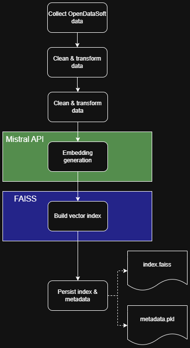
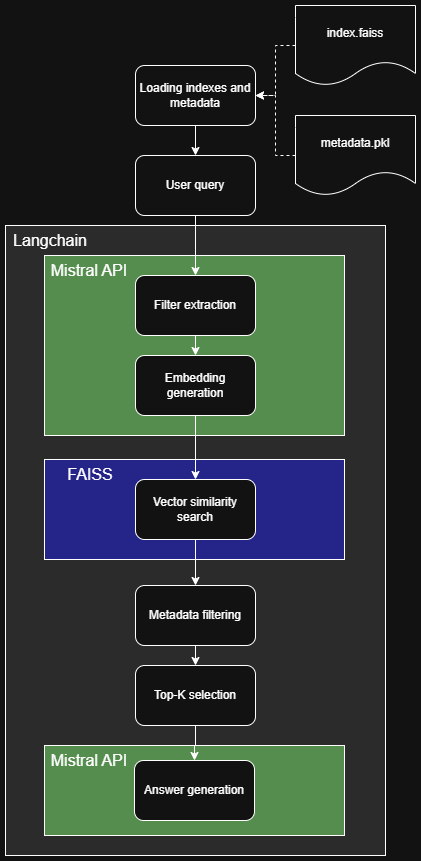

# RAG Pipeline & Chatbot with Mistral and FAISS

**Table of contents**

- [Project Goal](#-project-goal)
- [What This POC Demonstrates](#-what-this-poc-demonstrates)
- [Pipeline Architecture & Workflow](#-pipeline-architecture--workflow)
  - [Main Steps](#main-steps)
  - [Pipeline Diagram](#pipeline-diagram)
- [Tech Stack](#-tech-stack)
- [Running the Project](#-running-the-project)
  - [Prerequisites](#prerequisites)
  - [Start the Services](#start-the-services)
  - [Test Scripts](#test-scripts)
- [Outputs & Results](#-outputs--results)
- [Possible Improvements](#-possible-improvements)

---

## 🎯 Project Goal
This project is a proof-of-concept (POC) demonstrating a **RAG (Retrieval-Augmented Generation) pipeline** for events data.  
The goal is to:
- Fetch public events data from OpenDataSoft.
- Clean, preprocess, and structure the data for vector embedding.
- Build FAISS vector indexes for semantic search.
- Provide a chatbot API capable of answering questions based on the vectorized events data.

---

## 🧠 What This POC Demonstrates
- End-to-end RAG pipeline with data ingestion, preprocessing, vectorization, and semantic search.
- Integration of **Mistral embeddings** and FAISS for vector search.
- Chatbot service exposing a **FastAPI endpoint** for user questions.
- Practical usage of metadata filtering and structured prompts for generating accurate answers.
- Unit and integration testing setup to validate pipeline and chatbot functionalities.

---

## 🗂️ Pipeline Architecture & Workflow

### Main Steps
1. **Data Ingestion**  
   Retrieve events from OpenDataSoft API using region and date filters.

2. **Data Cleaning & Transformation**  
   - Parse JSON fields and dates.
   - Clean HTML text and concatenate event descriptions.
   - Transform schedules to datetime objects for vectorization.

3. **Vectorization & Indexing**  
   - Build embeddings with Mistral API.
   - Store embeddings in FAISS indexes.
   - Save associated metadata in a pickle file.

4. **Chatbot Service**  
   - Load FAISS indexes and metadata.
   - Receive user questions via API.
   - Extract filters and queries using system prompts.
   - Perform vector search + metadata filtering.
   - Generate final answers using Mistral LLM.

### Pipeline Diagram
<div style="display: flex; gap: 20px; justify-content: center;">
  
  
</div>

---

## ⚙️ Tech Stack
- **Python 3.11+**
- **FAISS** for vector indexing
- **Mistral API** for embeddings and generation
- **Pandas / NumPy** for data processing
- **FastAPI** for serving the chatbot
- **Docker & Docker Compose** for reproducible services
- **Pytest** for testing

---

## 🚀 Running the Project

### Prerequisites
- Docker Desktop installed
- Mistral API key available, either:
  - set as an environment variable:
    ```bash
    export MISTRAL_API_KEY="your_api_key_here"
    ```
  - Copy `.env.example` to `.env` and replace the placeholder with your own API key
    

### Start the Services
#### Download and vectorize datas
To download data from OpenDataSoft and vectorize them with Mistral API using, use the command line below.
If you already did this step, you can skip it unless you want to refresh the dataset.

```bash
    docker compose --profile vb up -d
```

Can take several minutes.

#### Launch the chatbot service

```bash
    docker compose --profile chatbot up -d
```

#### Test scripts (optional)
Local unit and integration tests are available:
```bash
# Test vector building functions
python -m pytest tests/test_build_vectors_functions.py

# Test chatbot service functions
python -m pytest tests/test_chatbot_service_functions.py
```

## 📊 Outputs and Results
After running the pipeline:
1. Vector indexes are saved under data/indexes/ as .faiss files
2. Metadata is saved as data/metadata.pkl
3. Chatbot API listens on http://localhost:8000 with a POST endpoint /ask 

```json
POST /ask
{
    "user_question": "trouve les prochaines visites de chateaux à Lyon"
}
```
4. Returned JSON includes the final answer generated by Mistral
```output
Voici les prochaines visites de châteaux à Lyon, ou des sites historiques similaires :

1. **Stand espaces partenaires – Fort de Vaise**
   - **Lieu** : Fort de Vaise, 25-27, boulevard Antoine de Saint-Exupéry, 69009 Lyon
   - **Modalités** : Entrée libre
   - **Lien** : [Fondation Renaud](http://www.fondation-renaud.com)
   - **Dates et horaires** :
     - Samedi 20 septembre 2025 de 10h00 à 18h00
     - Dimanche 21 septembre 2025 de 10h00 à 18h00
   - **Description** : Quatre acteurs du patrimoine vous accueillent sur le site du Fort de Vaise pour découvrir leurs actions. Le Fort de Vaise, construit en 1834, fait partie de la première ceinture de défense de Lyon. Vous pourrez rencontrer les organisateurs, découvrir des expositions, des conférences et des animations sur le thème du patrimoine architectural.

Les événements suivants ne correspondent pas exactement à des visites de châteaux, mais sont des visites historiques à Lyon :

1. **Parcours commenté "Le sixième, vous avez dit usines ?..."**
   - **Lieu** : Place du Maréchal Lyautey face au Café du Pond, Lyon 69006
   - **Modalités** : 10€, demi-tarif pour les adolescents, gratuit pour les enfants. Règlement en espèces ou chèque sur place. Réservation possible via [parcoursdhistoire.com](https://www.parcoursdhistoire.com)
   - **Dates et horaires** :
     - Dimanche 21 septembre 2025 de 14h00 à 16h00
     - Dimanche 19 octobre 2025 de 14h00 à 16h00
   - **Description** : Découvrez l'histoire industrielle du 6ème arrondissement de Lyon, un quartier aujourd'hui résidentiel, qui abritait autrefois des usines de renom. Le parcours révèle des bâtiments qui furent des sièges d'entreprises et parfois des lieux de production, certains transformés, d'autres disparus.
```

Swagger available at http://localhost:8000/docs

## 🔍 Possible Improvements
This POC can be extended and enhanced in several ways, based on the following feature roadmap:
- Open Agenda Data Ingestion:
	- Add incremental updates and automated scheduling for continuous ingestion.
	- Support multiple regions and event sources simultaneously.
- Vector Database & Semantic Search Engine:
	- Optimize FAISS indexes for faster queries and lower memory usage.
	- Implement caching strategies to reduce repeated embedding calls.
	- Add advanced filtering (partial matches, synonyms, multilingual support).
- RAG Chatbot & Conversational Memory:
	- Improve context tracking for multi-turn conversations.
	- Handle long-term memory to remember past user interactions.
	- Support more complex query understanding and reasoning.
- Geographic Context:
	- Automatically detect user location for personalized event suggestions.
	- Allow filtering by nearby events or custom regions.
- Backend API & Real-Time Web Search:
	- Add rate limiting, authentication, and usage monitoring.
	- Integrate real-time web data to supplement event information.
- Analytics & Dashboard:
	- Provide usage statistics, popular queries, and response accuracy metrics.
	- Visualize event trends and chatbot performance.
- User Accounts & Notifications:
	- Enable user-specific preferences and saved searches.
	- Send targeted notifications for relevant upcoming events.
- NLP Cost Optimization:
	- Reduce API calls via batching and vector caching.
	- Use lightweight models where high accuracy is not required.

Additional details on the improvement roadmap are available in `project_management_report.doc`
